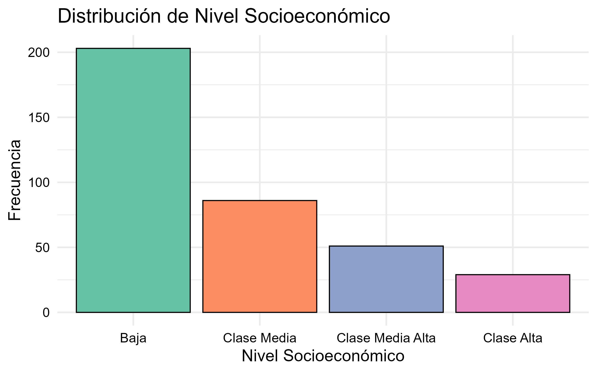
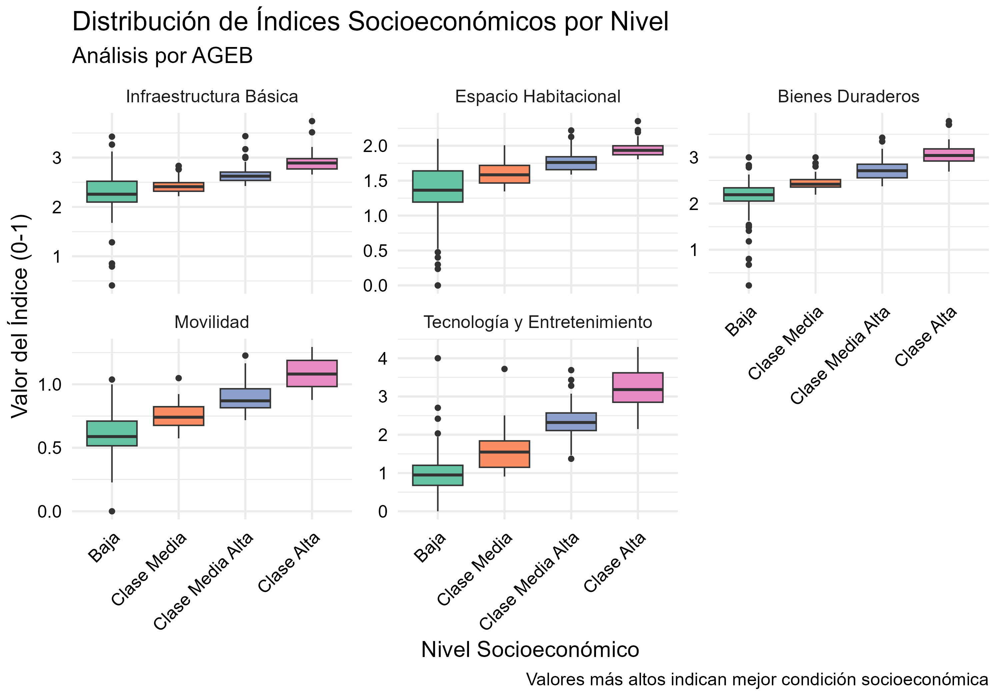
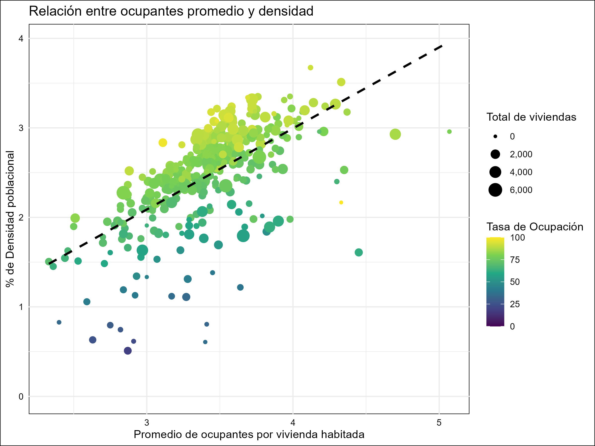
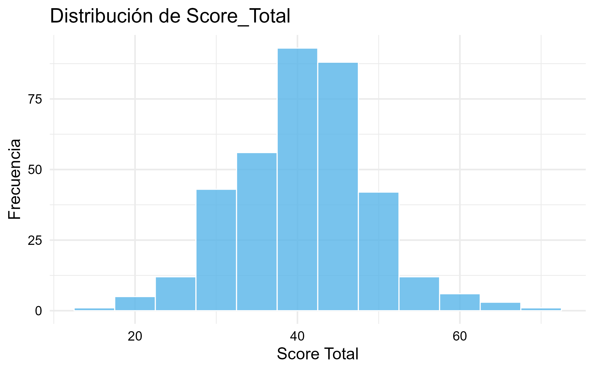
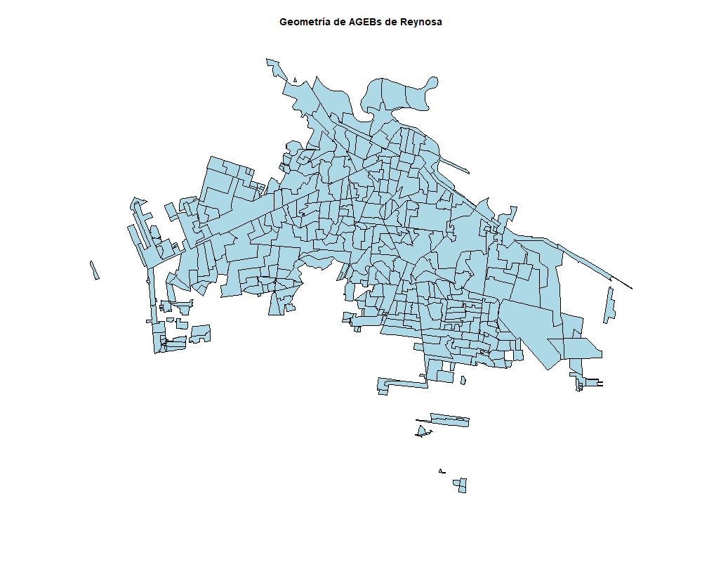
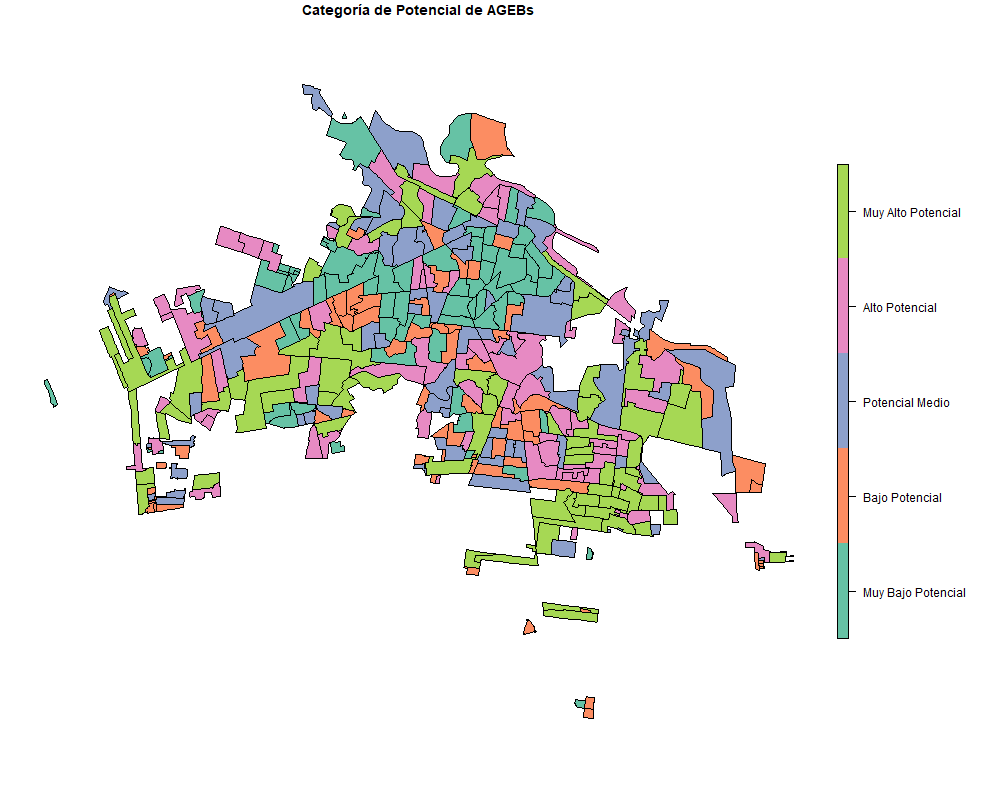

📊 Análisis Demográfico y Construcción de Indicadores a Nivel AGEB (Reynosa, INEGI Censo 2020)
Requisitos y dependencias
R >= 4.0

Paquetes: tidyverse, sf, leaflet, RColorBrewer, ggrepel, viridis, forcats

Datos: INEGI Censo de Población y Vivienda 2020 (AGEB urbana Reynosa)

1. Descripción general
Este proyecto realiza un análisis exploratorio-demográfico de Reynosa, Tamaulipas, utilizando datos abiertos del Censo de Población y Vivienda 2020 del INEGI.
El análisis se centra en el nivel AGEB (Área Geoestadística Básica), la unidad mínima de división territorial empleada por el INEGI, que agrupa manzanas urbanas con características sociodemográficas similares.

Objetivo principal:
Identificar zonas potenciales dentro de Reynosa para:

Evaluación y planeación de futuras aperturas de negocios y estudios de mercado.

Para ello se construyen y visualizan indicadores clave (demográficos, socioeconómicos y de vivienda) a nivel AGEB, facilitando la toma de decisiones basada en evidencia territorial.

2. Pasos y lógica del análisis
A. Obtención y carga de datos
Fuente: INEGI – Censo de Población y Vivienda 2020 (AGEB urbana).

Herramientas: R, tidyverse.

Carga inicial:

r
Copiar
Editar
library(tidyverse)
# ...otros paquetes...

setwd("C:/Users/Miguel Reyes/Desktop/Supply Chain Data Science Project")
reynx_datos <- read_csv("conjunto_de_datos_ageb_urbana_28_cpv2020.csv")

reynx_datos <- reynx_datos %>% filter(NOM_MUN == "Reynosa")
B. Análisis y transformación por bloques temáticos

1. Edades y estructura demográfica
   
Selección de columnas clave de edades.

Limpieza de valores erróneos/faltantes (asteriscos a cero).

Construcción de tibble con estructura poblacional por AGEB.

¿Por qué? Permite conocer la pirámide poblacional y la estructura por edades a nive``l territorial.

2. Estado civil
Segmentación de población 12+ por estado civil (solteros, casados, separados/divorciados/viudos).

Validación cruzada con el total de población 12+.

¿Por qué? Para validar integridad y analizar estructura familiar por AGEB.

3. Agregaciones de interés
Cálculo de población total, infantil, juvenil, adulta y adulta mayor por AGEB.

Transformaciones para obtener sub-segmentos (mujeres, hombres, grupos de edad clave).

¿Por qué? Permite análisis comparativos y diagnósticos territoriales.

4. Hogares y jefatura femenina/masculina
Cálculo de hogares por AGEB distinguiendo entre jefatura femenina y masculina.

¿Por qué? Ayuda a identificar vulnerabilidades y patrones de estructura familiar relevantes para intervención social o enfoque de mercado.

5. Vivienda y creación de índices sintéticos

Se analizaron características de vivienda (acceso a servicios, bienes, espacio, movilidad y tecnología).

Creación de 5 índices sintéticos (IIB, IEH, IBD, IM, ITE), cada uno representa una proporción respecto a viviendas particulares habitadas.

Importancia:
Estos índices permiten comparar condiciones materiales y de servicios entre AGEBs de forma estandarizada, y sirven de base para una clasificación socioeconómica propia usando percentiles (25, 50, 75).

6. Validación y visualización de índices
Se implementaron boxplots por nivel socioeconómico para validar la capacidad discriminante de los índices.

Ejemplo visual: el índice de tecnología muestra desigualdades claras entre clases altas y bajas.

¿Por qué?
Los índices permiten análisis focalizados para políticas públicas o segmentación de mercado.

⚠️ Nota: Los índices pueden superar 1, ya que suman proporciones de varias características (por ejemplo, muchas viviendas con computadora, internet y TV paga suman >1).

⚠️ Nota sobre el Índice de Potencial de Mejoras:
  Interpretación de valores negativos:
  El índice de potencial de mejoras puede tomar valores negativos en algunos AGEBs. Esto ocurre porque el índice da mayor peso a las carencias de infraestructura y espacio habitacional: si un AGEB tiene valores muy altos en estos componentes (es decir, ya cuenta con excelente infraestructura y espacio), la resta (1 - IIB) o (1 - IEH) resulta negativa.

¿Qué significa?
  
Valores negativos: El AGEB tiene un nivel de infraestructura y espacio superior al estándar y, por lo tanto, no es prioritario para intervenciones o mejoras (tiene “potencial de mejora” menor a cero).

Valores cercanos a cero: El AGEB cumple el estándar básico; prioridad baja a media.

Valores altos y positivos: El AGEB presenta carencias, por lo que sí es prioritario para acciones de mejora o inversión.

7. Desocupación de vivienda y hacinamiento
Desocupación: Se clasificó cada AGEB en Baja, Media, Alta o Muy Alta según el porcentaje de viviendas deshabitadas.

Hacinamiento:

Promedio de ocupantes por vivienda habitada

Densidad de habitantes

Tasa de ocupación de viviendas

Visualización: Gráfico de dispersión ocupantes promedio vs. densidad poblacional, coloreado por tasa de ocupación.

¿Por qué?
Identifica áreas con posible hacinamiento o infrautilización, útil para focalizar políticas de vivienda o estrategias comerciales.

8. Análisis económico poblacional
Cálculo de PEA, tasas de participación y desempleo por AGEB, diferenciadas por sexo.

Integración de todos los indicadores demográficos y económicos en un solo dataframe por AGEB (reynx_analisis_completo).

9. Score de potencial territorial (construcción de índice compuesto)

Se sintetizan todos los indicadores relevantes en un solo "Score_Total" para cada AGEB.

¿Cómo?

Indicadores clave se normalizan (0-100).

Se ponderan según relevancia (ver abajo).

Se crea un índice de potencial de mejoras habitacionales (más alto = más necesidad y oportunidad de mejora).

r
Copiar
Editar
Indice_Potencial_Mejoras = (
  (1 - IIB) * 0.40 +
  (1 - IEH) * 0.30 +
  IBD * 0.10 +
  IM * 0.10 +
  ITE * 0.10
)

Score_Total = (
  Score_Poblacion * 0.15 +
  Score_PEA * 0.18 +
  Score_Ocupacion * 0.12 +
  Score_Viviendas * 0.12 +
  Score_Ocupantes * 0.08 +
  Score_NSE * 0.20 +
  Score_Potencial_Mejoras * 0.15
)
Clasificación de AGEBs en 5 niveles (quintiles):
Muy alto potencial, Alto, Medio, Bajo, Muy bajo.

10. Visualización geoespacial interactiva
Se utiliza leaflet para crear mapas interactivos.

Cada AGEB se colorea por categoría de potencial y muestra popup con información relevante.

r
Copiar
Editar
library(leaflet)
# ... chunk esencial de leaflet ...
¿Por qué?
Permite identificar visualmente zonas de alto y bajo potencial, validando el análisis estadístico en el territorio real.

📍 Preparación de los Datos Espaciales
Para poder visualizar los resultados de potencial territorial por AGEB en un mapa interactivo, fue necesario obtener el shapefile de AGEBs urbanos de Reynosa a partir de los datos abiertos de INEGI, y asegurarse de que las coordenadas estuvieran en el sistema adecuado para Leaflet (WGS84, EPSG:4326).

Pasos clave:

Descargar el archivo shp de AGEBs urbanos de Reynosa desde INEGI.

Cargarlo en R usando sf.

Convertir las coordenadas al sistema WGS84 (EPSG:4326), que es el estándar para visualización web y mapas interactivos.

Ejemplo de Código
r
Copiar
Editar
library(sf)

# 1. Cargar el shapefile de AGEBs urbanos de Reynosa
mapa_reyno <- st_read("reynosa_map.shp")

# 2. Mapa coloreado por categorías
mapa_reyno <- reynosa_map %>%
  left_join(reyno_ageb_categorizado, by = c("CVE_AGEB" = "AGEB"))

mapa_reyno$Categoria_Potencial <- factor(
  mapa_reyno$Categoria_Potencial, 
  levels = c(
    "Muy Bajo Potencial", 
    "Bajo Potencial", 
    "Potencial Medio", 
    "Alto Potencial", 
    "Muy Alto Potencial"
  )
)

# Mapa directo
plot(mapa_reyno["Categoria_Potencial"])

# 3. Transformar las coordenadas al sistema WGS84
mapa_reyno_transformado <- st_transform(mapa_reyno, crs = 4326)

# 4. Enriquecer con información y crear popups
mapa_reyno_leaflet <- mapa_reyno_transformado %>%
  left_join(reyno_ageb_categorizado, by = c("CVE_AGEB" = "AGEB")) %>%
  mutate(
    popup_info = paste(
      "<strong>Información del AGEB:</strong> ",
      "<strong>AGEB:</strong>", CVE_AGEB, " ",
      "<strong>Categoría de Potencial:</strong>", Categoria_Potencial, " ",
      "<strong>Score Total:</strong>", round(Score_Total, 2), " ",
      "
",
      "<strong>Población Total:</strong>", Pob_Tot, " ",
      "<strong>Densidad de habitantes:</strong>", round(densidad_habitantes,2), " ",
      "<strong>Total Viviendas:</strong>", Total_Viviendas, " ",
      "<strong>Nivel Socioeconómico:</strong>", Nivel_Socioeconomico, " ",
      "
",
      "<strong>Indicadores:</strong> ",
      "<strong>Proporción PEA:</strong>", round(Prop_PEA,2), " ",
      "Tasa de Ocupación de Vivienda: ", round(tasa_ocupacion, 2), "%", " ",
      "Potencial de Mejoras: ", round(Indice_Potencial_Mejoras, 2)
    )
  )

¿Por qué transformar a WGS84?
La mayoría de los mapas interactivos en la web (incluyendo Leaflet y OpenStreetMap) requieren que los datos estén en el sistema de coordenadas WGS84 (EPSG:4326), que usa latitud y longitud en grados decimales. Si el shapefile original está en otro sistema de referencia (como Lambert, UTM, etc.), los polígonos no se mostrarán correctamente o aparecerán en otro lugar del mundo.

### Visualización de Mapas Interactivos

Para visualizar los mapas interactivos generados en el análisis:

> ⚠️ **Importante:** Los archivos `.html` de mapas interactivos deben **descargarse** y abrirse localmente en tu navegador para funcionar correctamente.

- [Descargar mapas interactivos desde Google Drive](https://drive.google.com/drive/folders/1OP6rpwfNss3tTkpkYsbOKHeHpo82teTe)
- [Archivos HTML individuales en GitHub](output/07_mapa_leaflet_categorias.html), [output/08_mapa_leaflet_score.html](output/08_mapa_leaflet_score.html)

12. Reflexión personal y valor profesional
Este proyecto representa mucho más que un ejercicio técnico: es testimonio de mi capacidad de adaptación y aprendizaje autónomo frente a nuevos retos.

Iniciativa propia: La motivación para abordar la geovisualización espacial y el análisis territorial surgió enteramente de mi interés por ampliar mis competencias, aún sin experiencia previa directa en visualización geoespacial ni el stack completo de R.

Adaptabilidad y aprendizaje ágil: Fui capaz de incorporar rápidamente nuevas herramientas, paquetes y metodologías, enfrentando retos técnicos y conceptuales para lograr resultados profesionales.

Integración de IA y fuentes de información: Aproveché recursos de IA como herramienta de consulta y resolución de problemas, combinando documentación oficial y buenas prácticas para acelerar el desarrollo.

Dominio del proceso de datos (ETL): Llevé el proyecto desde la recopilación y limpieza de datos, hasta el diseño de indicadores, integración y transformación de bases, y la creación de visualizaciones avanzadas.

Enfoque en toma de decisiones basada en datos: Cada paso del análisis estuvo orientado a producir insights útiles y accionables para la planeación estratégica, la intervención social y la toma de decisiones informadas en contextos urbanos.

En suma, este trabajo evidencia mi capacidad de autogestión, aprendizaje continuo y orientación a resultados, integrando nuevas tecnologías y métodos para resolver necesidades reales y aportar valor desde el análisis de datos.

13. Referencias y agradecimientos
INEGI (2020). Censo de Población y Vivienda 2020.

Comunidad R y recursos de AI por la ayuda en visualización avanzada.

Última actualización: Mayo 2025

📬 Contacto
¿Comentarios, sugerencias o colaboraciones?
Puedes contactarme a través de:

-[Mi perfil de LinkedIn](https://www.linkedin.com/in/marb951206/)

📧 reyes061295@gmail.com

📄 English Version / Versión en Inglés
(Scroll down for the English version of this documentation)

📊 Demographic Analysis and Indicator Construction at AGEB Level (Reynosa, INEGI Census 2020)
Requirements and dependencies
R >= 4.0

Packages: tidyverse, sf, leaflet, RColorBrewer, ggrepel, viridis, forcats

Data: INEGI Population and Housing Census 2020 (Urban AGEB, Reynosa)

1. General Description
This project conducts an exploratory demographic analysis of Reynosa, Tamaulipas, using open data from INEGI’s 2020 Population and Housing Census.
The analysis focuses on the AGEB (Área Geoestadística Básica) level, the smallest territorial unit used by INEGI, grouping urban blocks with similar sociodemographic characteristics.

Main Objective:
Identify potential areas within Reynosa for:

Evaluation and planning of future business openings and market studies.

To this end, key indicators (demographic, socioeconomic, and housing) are built and visualized at the AGEB level, supporting decision-making based on territorial evidence.

2. Steps and Analytical Logic
A. Data Acquisition and Loading
Source: INEGI – Population and Housing Census 2020 (Urban AGEB)
Tools: R, tidyverse

Initial load:

r
Copiar
Editar
library(tidyverse)
# ...other packages...

setwd("C:/Users/Miguel Reyes/Desktop/Supply Chain Data Science Project")
reynx_datos <- read_csv("conjunto_de_datos_ageb_urbana_28_cpv2020.csv")
reynx_datos <- reynx_datos %>% filter(NOM_MUN == "Reynosa")
B. Thematic Block Analysis and Transformation

1. Age and Demographic Structure
Select key age columns.

Clean erroneous/missing values (replace asterisks with zero).

Construct a tibble with population structure per AGEB.

Why? Understand population pyramid and age structure at a territorial level.

2. Marital Status
Segment 12+ population by marital status (single, married, separated/divorced/widowed).

Cross-validation with the total 12+ population.

Why? To validate data integrity and analyze family structure by AGEB.

3. Relevant Aggregations
Calculate total, child, youth, adult, and senior populations by AGEB.

Transform to obtain sub-segments (women, men, key age groups).

Why? Enables comparative and territorial diagnostic analyses.

4. Households and Female/Male Headship
Calculate households by AGEB, distinguishing female and male heads.

Why? Identifies vulnerabilities and family structure patterns relevant for social intervention or market focus.

5. Housing and Synthetic Index Construction
Analyzed housing characteristics (access to services, goods, space, mobility, technology).

Created 5 synthetic indexes (IIB, IEH, IBD, IM, ITE), each representing a proportion relative to private inhabited dwellings.

Importance:
These indexes standardize the comparison of material and service conditions among AGEBs, and serve as the basis for a proprietary socioeconomic classification using percentiles (25, 50, 75).

6. Index Validation and Visualization
Implemented boxplots by socioeconomic level to validate the discriminating power of the indices.

Example: The technology index clearly shows inequalities among high and low classes.

Why?
The indexes allow for targeted analyses for public policy or market segmentation.

⚠️ Note: The indices can exceed 1, as they sum proportions from various characteristics (e.g., many households with computer, internet, and pay TV).

⚠️ Note on the Improvement Potential Index:
Negative values occur when an AGEB has very high values in infrastructure and space (i.e., already excellent conditions), so (1 - IIB) or (1 - IEH) yields a negative.

Interpretation:

Negative values: AGEB has superior infrastructure/space, thus low priority for intervention/improvement (potential < 0).

Values near zero: AGEB meets the basic standard; low to medium priority.

High positive values: AGEB has deficiencies and is a priority for action/investment.

7. Housing Vacancy and Overcrowding
Vacancy: Each AGEB was classified as Low, Medium, High, or Very High based on % of uninhabited dwellings.

Overcrowding:

Average occupants per inhabited dwelling

Population density

Occupancy rate

Visualization: Scatterplot of average occupants vs. density, colored by occupancy rate.

Why?
Identifies areas with possible overcrowding or underutilization, useful for targeting housing policies or commercial strategies.

8. Economic Population Analysis
Calculation of EAP (Economically Active Population), participation rates, and unemployment rates by AGEB, disaggregated by sex.

Integration of all demographic and economic indicators in a single dataframe per AGEB (reynx_analisis_completo).

9. Territorial Potential Score (Composite Index Construction)
All relevant indicators are synthesized into a single Score_Total per AGEB.

How?

Key indicators are normalized (0-100).

Weighted according to relevance (see below).

An improvement potential index is created (higher = greater need/opportunity for improvement).

r
Copiar
Editar
Indice_Potencial_Mejoras = (
  (1 - IIB) * 0.40 +
  (1 - IEH) * 0.30 +
  IBD * 0.10 +
  IM * 0.10 +
  ITE * 0.10
)

Score_Total = (
  Score_Poblacion * 0.15 +
  Score_PEA * 0.18 +
  Score_Ocupacion * 0.12 +
  Score_Viviendas * 0.12 +
  Score_Ocupantes * 0.08 +
  Score_NSE * 0.20 +
  Score_Potencial_Mejoras * 0.15
)
AGEBs are classified into 5 levels (quintiles): Very High Potential, High, Medium, Low, Very Low.

10. Interactive Geospatial Visualization
Leaflet is used to create interactive maps.

Each AGEB is colored by potential category and includes a popup with relevant information.

r
Copiar
Editar
library(leaflet)
# ... essential leaflet chunk ...
Why?
Visually identifies high and low potential areas, validating the statistical analysis on real territory.

Spatial Data Preparation

To visualize the results by AGEB on an interactive map, the urban AGEB shapefile for Reynosa was obtained from INEGI and transformed to the appropriate coordinate system for Leaflet (WGS84, EPSG:4326).

Key Steps:

Download the urban AGEB shapefile for Reynosa from INEGI.

Load it in R using sf.

Convert coordinates to WGS84 (EPSG:4326).

r
Copiar
Editar
library(sf)
mapa_reyno <- st_read("reynosa_map.shp")

# 2. Map Colored by Potential Categories
mapa_reyno <- reynosa_map %>%
  left_join(reyno_ageb_categorizado, by = c("CVE_AGEB" = "AGEB"))

mapa_reyno$Categoria_Potencial <- factor(
  mapa_reyno$Categoria_Potencial, 
  levels = c(
    "Muy Bajo Potencial", 
    "Bajo Potencial", 
    "Potencial Medio", 
    "Alto Potencial", 
    "Muy Alto Potencial"
  )
)

# Direct map plot
plot(mapa_reyno["Categoria_Potencial"])

# 3. Transform coordinates to WGS84 system
mapa_reyno_transformado <- st_transform(mapa_reyno, crs = 4326)

# 4. Enrich with information and create popups
mapa_reyno_leaflet <- mapa_reyno_transformado %>%
  left_join(reyno_ageb_categorizado, by = c("CVE_AGEB" = "AGEB")) %>%
  mutate(
    popup_info = paste(
      "<strong>AGEB Information:</strong> ",
      "<strong>AGEB:</strong>", CVE_AGEB, " ",
      "<strong>Potential Category:</strong>", Categoria_Potencial, " ",
      "<strong>Total Score:</strong>", round(Score_Total, 2), " ",
      "
",
      "<strong>Total Population:</strong>", Pob_Tot, " ",
      "<strong>Population Density:</strong>", round(densidad_habitantes,2), " ",
      "<strong>Total Housing Units:</strong>", Total_Viviendas, " ",
      "<strong>Socioeconomic Level:</strong>", Nivel_Socioeconomico, " ",
      "
",
      "<strong>Indicators:</strong> ",
      "<strong>PEA Proportion:</strong>", round(Prop_PEA,2), " ",
      "Housing Occupancy Rate: ", round(tasa_ocupacion, 2), "%", " ",
      "Improvement Potential: ", round(Indice_Potencial_Mejoras, 2)
    )
  )

**Why transform to WGS84?**  
Most web-based interactive maps (including Leaflet and OpenStreetMap) require data to be in the WGS84 coordinate system (EPSG:4326), which uses latitude and longitude in decimal degrees. If the original shapefile is in another reference system (such as Lambert, UTM, etc.), the polygons will not display correctly or will appear in the wrong part of the world.

---

### Interactive Map Visualization

To view the interactive maps generated in this analysis:

> ⚠️ **Important:** The `.html` files for interactive maps must be **downloaded** and opened locally in your browser to function correctly.

- [Download interactive maps from Google Drive](https://drive.google.com/drive/folders/1OP6rpwfNss3tTkpkYsbOKHeHpo82teTe)
- [Individual HTML files on GitHub](output/07_mapa_leaflet_categorias.html), [output/08_mapa_leaflet_score.html](output/08_mapa_leaflet_score.html)

12. Personal Reflection and Professional Value
This project is much more than a technical exercise—it demonstrates my adaptability and self-driven learning facing new challenges.

Own initiative:
The motivation to tackle spatial geovisualization and territorial analysis was entirely self-driven, despite no previous direct experience with geospatial visualization or the full R stack.

Adaptability and fast learning:
I was able to quickly incorporate new tools, packages, and methodologies, overcoming technical and conceptual hurdles to achieve professional results.

Integration of AI and information sources:
I leveraged AI resources as a consulting and problem-solving tool, combining official documentation and best practices to accelerate development.

Mastery of the data process (ETL):
I took the project from data gathering and cleaning to indicator design, database integration/transformation, and advanced visualization.

Data-driven decision-making:
Each step of the analysis aimed to produce useful and actionable insights for strategic planning, social intervention, and evidence-based decision making in urban contexts.

In sum, this work evidences my self-management, continuous learning, and results orientation—integrating new technologies and methods to address real needs and add value through data analysis.

13. References and Acknowledgements
INEGI (2020). Population and Housing Census 2020.

R Community and AI resources for help with advanced visualization.

Last updated: May 2025

📬 Contact
Comments, suggestions, or collaboration?

-[My LinkedIn Profile](https://www.linkedin.com/in/marb951206/)

-📧 reyes061295@gmail.com

